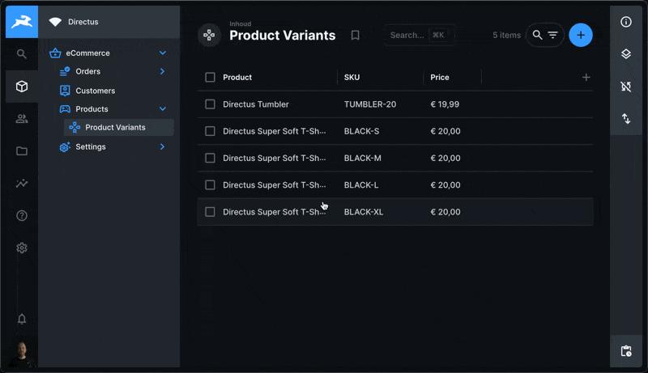

# Directus Simple Currency Field Extension

A Directus extension that provides a simple and efficient way to handle currency
fields in your Directus project. This extension includes both an interface for
editing currency values and a display component for viewing them.

<!-- IMAGE_URL_MARKER -->

<!-- END_IMAGE_URL_MARKER -->

## Features

- 💰 Stores currency values as DECIMAL type with precision and scale support
- 🌍 Supports multiple currencies (configurable per field)
- 🎨 Uses enhanced input validation to ensure proper currency values
- 🔄 Leverages JavaScript's Intl API for locale-aware currency formatting
- 📱 Fully responsive and compatible with Directus's design system
- 🌐 Displays in the user's preferred Directus interface language (all Directus
  languages supported)
- ⚙️ Configurable precision and scale (configurable per field)

## Installation

### Via Directus Marketplace

The extension can be installed directly from the Directus Marketplace in your
Directus admin panel.

### Manual Installation

```bash
# Using pnpm
pnpm add directus-extension-simple-currency-field@1.0.0
```

### Custom Dockerfile

If you're using a custom Dockerfile for your Directus instance, you can add this
extension by including:

```dockerfile
FROM directus/directus:11.5.1
LABEL authors="Some Name <someone@someone.com>"

USER root

RUN <<EOF
  corepack enable
EOF

USER node

# Add the extension
RUN pnpm add directus-extension-simple-currency-field@1.0.0
```

## Usage

1. Create a new field in your collection and select "Currency" as the type
2. Configure the currency in the interface options
3. Make sure to select "Currency Display" as the display option in advanced
   settings
4. Optionally configure precision and scale in the advanced options

### Configuration Options

When setting up the field interface, you can configure:

- **Currency**: The currency code to use (e.g., USD, EUR, GBP)
- **Precision**: The total number of digits (in advanced options)
- **Scale**: The number of decimal places (in advanced options)

The display component will automatically use the currency configuration from the
interface and respect the field's precision and scale settings.

> **Note**: The extension supports all current Directus languages. If you need
> support for additional currencies, please create an issue in the repository.

### API Support

When working with the API, you have two options to access the currency
information:

1. **Add a read-only field**: Add a field to your collection with the currency
   code as a default value and set it to read-only (and optionally hidden for
   Studio users).

2. **Use the SDK**: Retrieve the currency from the field options using the
   Directus SDK. This requires an additional API call, so choose the approach
   that best fits your situation.

## Development

To build the extension for development:

```bash
# Install dependencies
pnpm install

# Build the extension
pnpm build

# Build the extension and watch for changes
pnpm dev

# Lint the project
pnpm lint

# Fix lint issues
pnpm lint:fix
```

### Project Structure

- `src/currency-interface/` - Currency input interface component
- `src/currency-display/` - Currency display component
- `src/shared/` - Shared utilities and constants

## Requirements

- Directus version >=11.0.0 <=12.0.0

## Contributing

Contributions are welcome! Here's how you can help:

1. Create an issue first to discuss your proposed changes
2. Fork the repository
3. Create a feature branch: `git checkout -b feature/my-new-feature`
4. Commit your changes: `git commit -am 'Add some feature'`
5. Push to the branch: `git push origin feature/my-new-feature`
6. Submit a pull request

## Continuous Integration

This project uses GitHub Actions for continuous integration and deployment:

- When a new release is created on GitHub, the extension is automatically built
  and published to NPM
- The published package is available with public access on the NPM registry

## License

MIT License

Happy coding!
